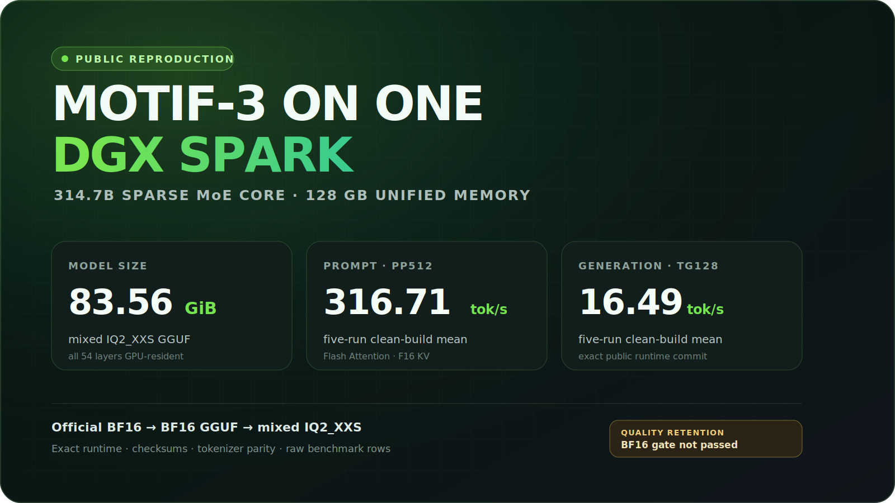

# Motif-3 315B on one DGX Spark



I wanted to know whether the final
[Motif-3](https://huggingface.co/Motif-Technologies/Motif-3) checkpoint could
live entirely in a DGX Spark's 128 GB unified memory, without sending model
layers back to the CPU. This is the build that worked.

The short version: the 314.7B core model fits in **83.56 GiB**, prompt
processing reaches **316.71 tok/s**, and 128-token generation runs at
**16.49 tok/s** on my Spark. The GGUF, pinned runtime base, tokenizer-exact
patch, chat template, and benchmark rows are all public.

**Download the model:**
[jhkim55/Motif-3-Direct-IQ2-XXS-DGX-Spark](https://huggingface.co/jhkim55/Motif-3-Direct-IQ2-XXS-DGX-Spark)

## 한국어 요약

한마디로, 3,147억 파라미터 규모의 sparse MoE인 Motif-3 핵심 모델을
DGX Spark 한 대의 128 GB 통합 메모리에 전부 올려 실제로 구동한
작업입니다. 최종 GGUF는 83.56 GiB이고, 공개한 동일 빌드에서 pp512
316.71 tok/s, tg128 16.49 tok/s를 기록했습니다.

이 작업의 핵심은 단순히 모델을 2비트로 줄인 데 있지 않습니다. 공식
BF16 체크포인트에서 직접 만든 혼합 IQ2_XXS GGUF, 고정한 llama.cpp 기반
커밋과 토크나이저 수정 패치, 토크나이저 일치 검증, 원시 벤치마크와
체크섬을 한 묶음으로 공개했습니다. 다운로드가 끝나면
[`scripts/verify_download.sh`](scripts/verify_download.sh)로 모델과 템플릿을
읽기 전용으로 확인할 수 있습니다.

다만 이것은 **단일 Spark 구동 가능성에 대한 성공 사례**이지, BF16과 같은
품질을 보장하는 모델은 아닙니다. 사전에 정한 perplexity·KL 품질 유지
기준은 통과하지 못했습니다. 로컬 연구와 시스템 실험에는 유용하지만,
중요한 용도라면 자신의 데이터로 먼저 검증해 주세요.

## What worked

| Item | Result |
|---|---:|
| Source | official BF16 at `883d5c441fe3bb994c7b57e60f49e26147f85512` |
| Parameters | 314,701,772,930 |
| Final file | 89,720,474,560 bytes / 83.56 GiB |
| BF16-to-GGUF reduction | 7.02x smaller |
| Effective storage | 2.2805 bits per element |
| pp512 | 316.71 tok/s |
| pp2048 | 312.76 tok/s |
| tg128 | 16.49 tok/s |
| pp2048 + tg128 | 149.33 tok/s |

Those four speeds come from one clean public-build session with five
repetitions per shape. The earlier three-session campaign landed in the same
range; both sets are kept in [Results](docs/RESULTS.md).

## Two things to know first

First, this does **not** run with stock upstream llama.cpp today. Motif-3 needs
its model port, GQA-5 Flash Attention support, and its actual tokenizer rules.
The measured runtime base is public at
[`cc3f13b3f172978d7b3c215780d4cc98bb0e1c80`](https://github.com/hebo1221/llama.cpp/commit/cc3f13b3f172978d7b3c215780d4cc98bb0e1c80).
Release v1.1.0 adds a hash-pinned
[`Motif-only tokenizer patch`](patches/motif3-tokenizer-exact-v1.patch) on top
of that commit. It fixes prompt token IDs; it does not change the GGUF weights
or retroactively turn the published speed rows into patched-runtime results.

Second, fitting the model is not the same as preserving BF16 quality. On a
fixed 49,152-token held-out comparison, this quant measured 1.4115x perplexity
and 0.4541 mean KL against BF16. It missed both preservation gates I set before
the run. I would use it for local research and systems work, not as a drop-in
BF16 replacement.

## Download and run

### 1. Make room

The tested machine was one NVIDIA DGX Spark. Plan for:

- about 90 GB for the model itself;
- at least 110 GB of free disk while cloning and building the runtime;
- the Spark's full 128 GB unified-memory pool, with other GPU workloads stopped;
- Git, CMake, a C++ compiler, the CUDA toolkit, and the `hf` CLI.

Other 128 GB NVIDIA systems may work, but I have not measured them.

### 2. Download the model and template

```bash
mkdir -p model

hf download jhkim55/Motif-3-Direct-IQ2-XXS-DGX-Spark \
  motif3-direct-iq2xxs.gguf \
  motif3-llama.cpp.jinja \
  --revision 3511f72d7ceac63e2931b27e1666766f2ad18d54 \
  --local-dir model

sha256sum model/motif3-direct-iq2xxs.gguf
```

The expected model digest is:

```text
9d6f7aee57f0271223f51d69c63d8576a259809e9f05e2ac596512e940c80c5a
```

### 3. Build the runtime

```bash
git clone --branch motif3-dgx-spark-v1 --single-branch \
  https://github.com/hebo1221/llama.cpp.git runtime

git -C runtime checkout cc3f13b3f172978d7b3c215780d4cc98bb0e1c80

git clone --branch v1.1.0 --depth 1 \
  https://github.com/hebo1221/motif3-dgx-spark.git release-files

sha256sum release-files/patches/motif3-tokenizer-exact-v1.patch
git -C runtime apply --check --unidiff-zero \
  ../release-files/patches/motif3-tokenizer-exact-v1.patch
git -C runtime apply --unidiff-zero \
  ../release-files/patches/motif3-tokenizer-exact-v1.patch

git -C runtime diff --binary --no-ext-diff | sha256sum

cmake -S runtime -B runtime/build \
  -DCMAKE_BUILD_TYPE=Release \
  -DGGML_CUDA=ON \
  -DGGML_CUDA_FA=ON \
  -DGGML_CUDA_GRAPHS=ON \
  -DGGML_NATIVE=ON \
  -DLLAMA_BUILD_UI=OFF \
  -DLLAMA_USE_PREBUILT_UI=OFF

cmake --build runtime/build --target llama-server llama-bench -j 12
```

The patch file should hash to
`5eba842cd63731e3ee39c60c43134ef59a3a64c9d28c2aa58c3073225c6545cf`.
The resulting normal Git diff should hash to
`09abc52c2f7ff9f2cb3e9b8edd3af03684840969d0cdc7f24fd7aa63ca3207f3`.
The patch is restricted to Motif tokenizer handling; other tokenizer families
keep their existing paths.

The UI is disabled on purpose. It keeps the build smaller and avoids pulling a
separate web bundle that is unrelated to inference.

### 4. Start a local OpenAI-compatible server

```bash
runtime/build/bin/llama-server \
  -m model/motif3-direct-iq2xxs.gguf \
  -ngl 99 \
  -fa on \
  -ctk f16 \
  -ctv f16 \
  -b 2048 \
  -ub 512 \
  -c 32768 \
  -np 1 \
  --host 127.0.0.1 \
  --port 8080 \
  --no-ui \
  --jinja \
  --chat-template-file model/motif3-llama.cpp.jinja
```

Keep it on `127.0.0.1` unless you have added authentication and understand the
network exposure. Once the model is ready:

```bash
curl -fsS http://127.0.0.1:8080/health

curl -fsS http://127.0.0.1:8080/v1/chat/completions \
  -H 'Content-Type: application/json' \
  -d '{
    "messages": [
      {"role": "user", "content": "한국의 수도는 어디인가요? 한 문장으로 답해주세요."}
    ],
    "temperature": 0,
    "max_tokens": 24,
    "chat_template_kwargs": {"enable_thinking": false}
  }'
```

The clean-build smoke test for the published performance baseline returned
`한국의 수도는 서울입니다.` and reported `b10498-cc3f13b3f`. That smoke test and
the speed rows predate the v1.1.0 tokenizer-exact patch.

## Re-run the benchmark

Do this only when the model is not already loaded by another process:

```bash
runtime/build/bin/llama-bench \
  -m model/motif3-direct-iq2xxs.gguf \
  -ngl 99 -fa on \
  -ctk f16 -ctv f16 \
  -b 2048 -ub 512 -t 20 \
  --delay 3 \
  -p 512,2048 \
  -n 128 \
  -pg 2048,128 \
  -r 5 \
  -o jsonl
```

The normalized JSONL from the clean run is in
[`evidence/clean_runtime_benchmark.jsonl`](evidence/clean_runtime_benchmark.jsonl),
with the build and smoke-test receipt in
[`evidence/clean_runtime_verification.json`](evidence/clean_runtime_verification.json).

## What is inside the GGUF

This is mixed precision, not a pure 2-bit file. The large routed-expert tensors
use IQ2_XXS; embeddings, output, attention, routing, and control tensors keep
more precision where the memory budget allowed it.

| Stored type | Tensors | Payload bytes |
|---|---:|---:|
| IQ2_XXS | 306 | 78,631,821,312 |
| BF16 | 424 | 7,252,475,904 |
| Q8_0 | 2 | 1,916,272,640 |
| Q2_K | 6 | 1,357,676,544 |
| F32 | 1,424 | 552,591,880 |

The path was official BF16 -> BF16 GGUF -> IQ2_XXS. There was no Q5
intermediate and no `--allow-requantize` step.

## What I checked

- all 54 model layers loaded on the GPU;
- the public runtime loaded this exact 89.72 GB artifact;
- `/health`, `/slots`, and one real Chat Completions request completed;
- the patched public-runtime base matched the official tokenizer on 115,618
  corpus token IDs and 318,951 deterministic fuzz token IDs using the final
  GGUF's embedded `motif3` metadata;
- a source-identical extended candidate matched all 4,164,390 token IDs from
  591,984 generated cases plus the two corpora;
- 15 existing llama.cpp tokenizer fixtures plus the Motif Unicode regression
  test all passed;
- the model file, source shards, template, tensor inventory, and public
  evidence files are hash-bound.

The original aggregate comparison remains in
[`evidence/tokenizer_parity.json`](evidence/tokenizer_parity.json). The
v1.1.0 mechanism-specific suites, patch identity, and claim boundaries are in
[`evidence/tokenizer_exact_v1.json`](evidence/tokenizer_exact_v1.json).

## Boundaries I would not gloss over

- The native MTP head is not in this GGUF, so there is no MTP speculative gain.
- The parent advertises 256K context; this release does not establish retained
  256K retrieval or generation quality.
- Tool calling is fragile at this bit rate. Schema or parser repair can improve
  formatting, but it does not repair a bad call/no-call decision.
- `-c` is the server's total context budget. With multiple slots, it is split
  between them. Check `/slots` instead of assuming every request gets the full
  value.
- Internal task sets are reported only as diagnostics. They are not public
  leaderboard scores.
- Two passive quantization-provenance fields retain local build paths. They do
  not affect inference; the current SHA binds those bytes, and any cleaned
  model revision will get a new digest rather than a silent replacement.
- The tokenizer-exact patch changes prompt tokenization, not the IQ2 weights.
  The published throughput rows were measured on the pinned v1.0.0 runtime
  base and have not been re-labeled as v1.1.0 measurements.

## Open question: model behavior or deployment trade-off?

The held-out perplexity and KL comparison establishes that this 2.2805 bp/e
artifact loses information relative to BF16. It does not establish how that
loss maps to downstream behavior: which failures are already present in the
parent model, which appear only after quantization, or which tensor families
account for most of the change.

I opened [a focused collaboration discussion](https://github.com/hebo1221/motif3-dgx-spark/discussions/1)
for three kinds of evidence:

- paired task results from the official BF16 model or a traceable Q5 build;
- expert-aware or layer-aware mixed-precision proposals that could still fit
  safely in 128 GB;
- independent DGX Spark throughput and memory reproductions.

The absent MTP head is a separate speculative-speed limitation, not an
explanation for the target model's measured BF16-to-IQ2 distribution shift.
Configurations and raw results that disagree with mine are welcome.

## The longer version

- [How the file was made](docs/METHOD.md)
- [Results and limitations](docs/RESULTS.md)
- [What the failed repair experiments taught me](docs/ENGINEERING_FINDINGS.md)
- [Runtime details and troubleshooting](docs/RUNTIME.md)
- [Machine-readable metrics](evidence/public_metrics.json)

## Share your result

If you run this on another DGX Spark or a similar 128 GB NVIDIA system, please
use the [benchmark report form](https://github.com/hebo1221/motif3-dgx-spark/issues/new?template=benchmark.yml).
Exact commands and raw `llama-bench` JSONL are much more useful than a single
headline number. Questions and early observations are welcome in
[Discussions](https://github.com/hebo1221/motif3-dgx-spark/discussions).

## License and attribution

The repository code and original documentation are MIT licensed. The derived
model follows the upstream Motif-3 MIT license and retains upstream
attribution; see [NOTICE](NOTICE.md). This is an independent community project,
not an official Motif Technologies or NVIDIA release.
